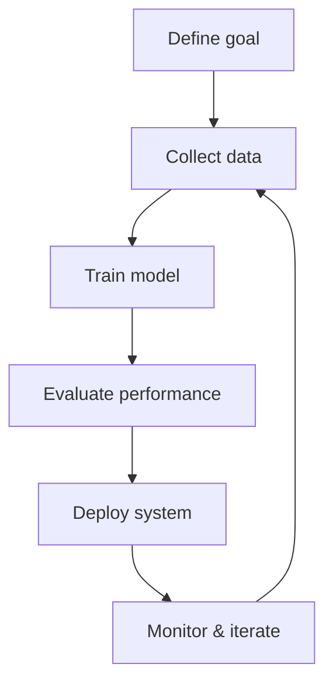

# AI Engineering Notes

Welcome to the AI Engineering Notes documentation.

This page captures the learning, experiments, and projects from an AI engineering journey. It is designed to help track progress, organize insights, and share practical work on building AI systems.

## What you will find here

- Learning notes for key AI engineering topics
- Project summaries and implementation details
- Tools, frameworks, and workflows used during the journey
- Reflections on architecture, evaluation, and deployment

## Why this documentation exists

AI engineering is a mix of research, system design, and software engineering. This documentation exists to make the journey easier to revisit, share, and improve over time.

## How to use this site

- Explore project pages for hands-on examples
- Return often as the repository grows and updates

## Goals of the learning journey

- Build strong foundations in machine learning and data engineering
- Learn how to design reliable AI workflows
- Apply practical tools for model development and deployment
- Capture lessons learned in a reusable format

## Example AI engineering flow

This diagram shows a simple iterative process for AI engineering, from goal definition through monitoring and continuous improvement.
