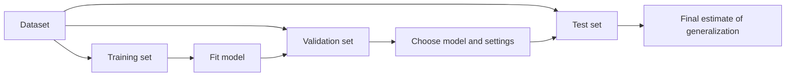

# Model Evaluation

Status: Done

Model evaluation answers a practical question: how well should we expect a model to perform on new, unseen data?

## The Core Split

Separate data before fitting a model:



- **Training set:** used to learn model parameters.
- **Validation set:** used to compare models, features, and hyperparameters.
- **Test set:** used once at the end to estimate performance on unseen data.

For a small learning exercise, a single train/test split is enough to practice the workflow. For more reliable estimates, use cross-validation on the training data and reserve a final test set.

## Data Leakage

Data leakage happens when information unavailable at prediction time influences training or model choices. It makes evaluation scores look better than real-world performance.

Common examples:

- Scaling, imputing, or selecting features using the full dataset before splitting.
- Choosing a model repeatedly after checking its test-set score.
- Including a feature that is recorded after the outcome occurs.

Fit preprocessing steps on training data only. In scikit-learn, a `Pipeline` helps enforce this rule:

```python
from sklearn.linear_model import LogisticRegression
from sklearn.pipeline import Pipeline
from sklearn.preprocessing import StandardScaler

model = Pipeline([
    ("scale", StandardScaler()),
    ("classify", LogisticRegression(max_iter=1_000)),
])
model.fit(X_train, y_train)
```

## Baselines

A model score means little without a reference point.

- For regression, predict the training-target mean for every example.
- For classification, predict the majority class for every example.

Your model should improve meaningfully on its baseline, not merely produce a nonzero score.

## Regression Metrics

Let \(y_i\) be the actual target and \(\hat{y}_i\) be the prediction.

### Mean Absolute Error

$$
\mathrm{MAE} = \frac{1}{n}\sum_{i=1}^{n}|y_i - \hat{y}_i|
$$

MAE is the average prediction mistake in target units. Lower is better.

### Root Mean Squared Error

$$
\mathrm{RMSE} = \sqrt{\frac{1}{n}\sum_{i=1}^{n}(y_i - \hat{y}_i)^2}
$$

RMSE penalizes large errors more strongly than MAE. Lower is better.

### R-squared

$$
R^2 = 1 - \frac{\sum_i(y_i - \hat{y}_i)^2}{\sum_i(y_i - \bar{y})^2}
$$

On a test set, \(R^2\) estimates the proportion of target variation explained by the model relative to predicting the mean. A negative value means the model performed worse than that baseline.

## Classification Metrics

For a binary classifier, define a positive class and count predictions:

| Actual / Predicted | Positive | Negative |
| --- | ---: | ---: |
| Positive | True positive (TP) | False negative (FN) |
| Negative | False positive (FP) | True negative (TN) |

From these counts:

$$
\mathrm{Precision} = \frac{TP}{TP + FP}
$$

Precision asks: when the model predicts positive, how often is it right?

$$
\mathrm{Recall} = \frac{TP}{TP + FN}
$$

Recall asks: of all actual positive examples, how many did the model find?

$$
\mathrm{Accuracy} = \frac{TP + TN}{TP + TN + FP + FN}
$$

Accuracy can be misleading for an imbalanced dataset. Check the confusion matrix and precision/recall alongside it.

## Practical Workflow

1. Frame the prediction task and choose a metric that reflects the cost of mistakes.
2. Split data before fitting preprocessing or models.
3. Build and score a simple baseline.
4. Train candidate models only on training data.
5. Use validation data or cross-validation for decisions.
6. Evaluate the final choice once on the test set.
7. Inspect failures and record what the score does and does not prove.

## Related Pages

- [Linear Regression](linear-regression.md)
- [Notebook Index](../notebooks/index.md)
