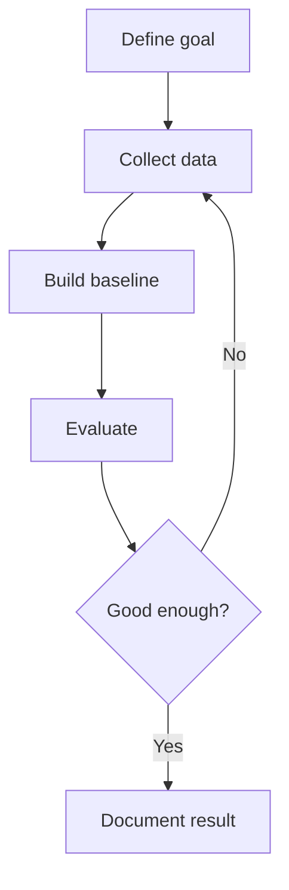
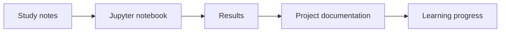
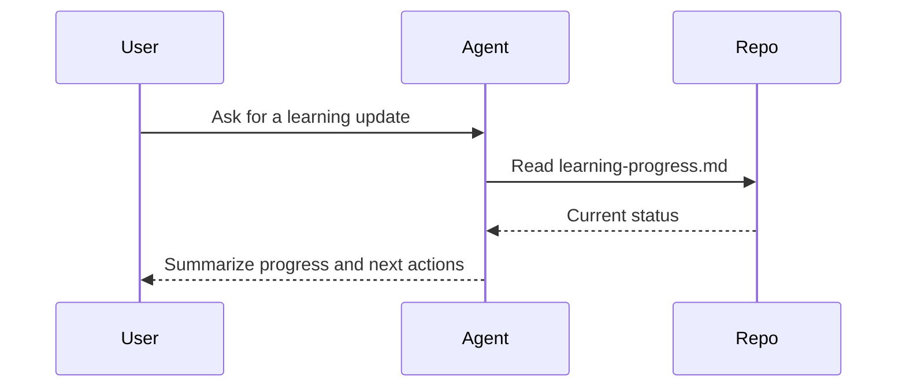
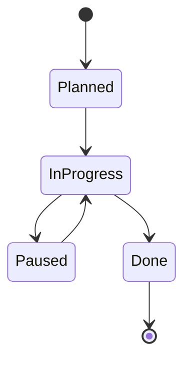

# Mermaid Diagrams

Status: Ready

This MkDocs site is configured to render Mermaid diagrams inside Markdown files.

## Configuration

Mermaid support is enabled in `ai-docs/mkdocs.yml` through `pymdownx.superfences`:

```yaml
markdown_extensions:
  - pymdownx.superfences:
      custom_fences:
        - name: mermaid
          class: mermaid
          format: !!python/name:pymdownx.superfences.fence_code_format
```

## Basic Usage

Use a fenced code block with `mermaid` as the language:

````markdown

````

Rendered example:


## Useful Diagram Types

### Flowchart

Use for workflows, learning paths, experiments, and decision trees.



### Sequence Diagram

Use for agent workflows, API calls, and multi-system interactions.



### State Diagram

Use for lifecycle notes such as project status or model deployment status.



## Verification

Build the docs with strict mode:

```bash
.venv/bin/mkdocs build --config-file ai-docs/mkdocs.yml --strict
```

Run the local docs server when previewing diagrams:

```bash
.venv/bin/mkdocs serve --config-file ai-docs/mkdocs.yml
```

Then open the local URL shown by MkDocs.

## Diagram Guidelines

- Use diagrams when they clarify structure, flow, or relationships.
- Keep node labels short.
- Prefer multiple small diagrams over one crowded diagram.
- Use Mermaid source as the editable truth instead of screenshots.
- Add a short sentence before or after the diagram explaining what it shows.
